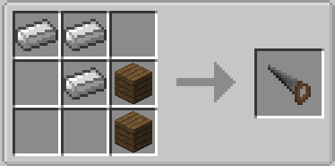
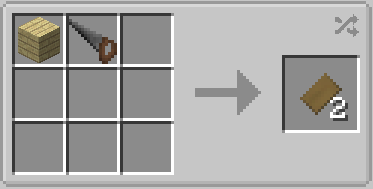
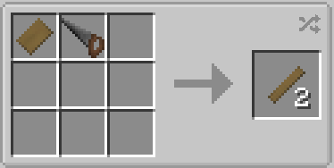
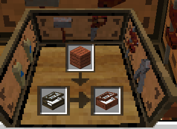
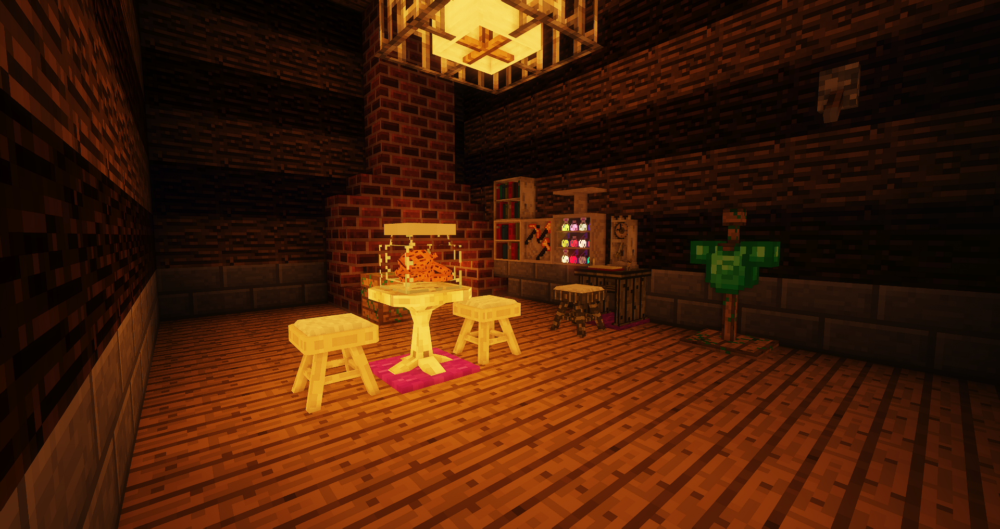

This is a short guide covering some of the features of bibliocraft 

If you ever wanted to spruce up your home bibliocraft has all the furniture you will ever need.

For the best option when customizing use framed furniture.

To create it you will need a saw!

After you acquire a saw, saw down some planks into framing sheets and boards.

Once you've made some framed furniture insert inside a framed furniture paneler
with this block you can add different wooden and log textures to framed blocks.

#Optifine can cause issues with this mod use with caution

#If you wish to find out more check the mods wiki - https://www.bibliocraftmod.com/
