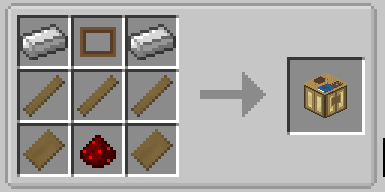
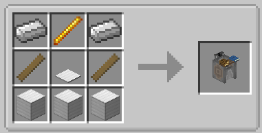
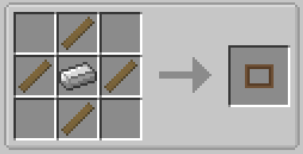
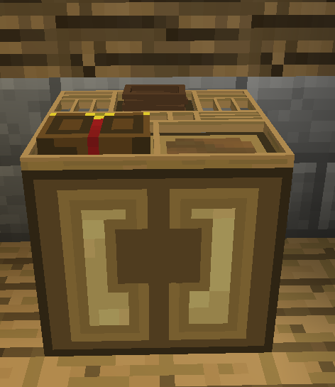
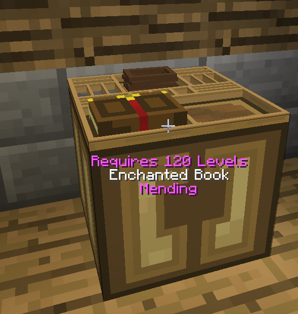
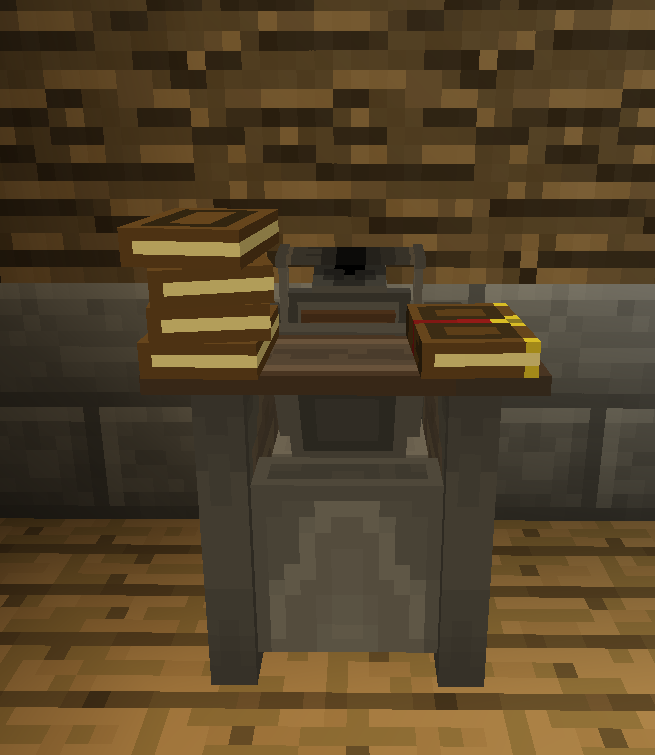

# Enchantment Printing
___

Wanna more guaranteed way of getting enchants why not duplicate them?

To begin you will need a typesetting table and printing press.

After crafting them, place them down.

With those blocks setup your onto the next step.

The printing press will need an enchanted book placed in it as well as print press cases.

To duplicate enchants sneak click the book and it will be turned into a enchanted plate

This process cost levels to activate, to see how many levels are needed
you can wear reading glasses or monocle.

Moving on to the typesetting table place ink sacs inside it and books 
when you place an enchanted plate inside it will begin to print the enchantment from the plate onto any attached books.

