# Growing Gardens
___

Several different types of Gardens grow across different biomes in the world.

Gardens share few crops between them, encouraging you to go out and collect each crop from all of them.

To collect crops from a Garden, Left-click or destroy it.

It move a Garden and permit it to grow, as is said in the mod notes (I have not seen Gardens spread), Shift Left-click. This will drop the Garden item itself.

# Arid Gardens
___

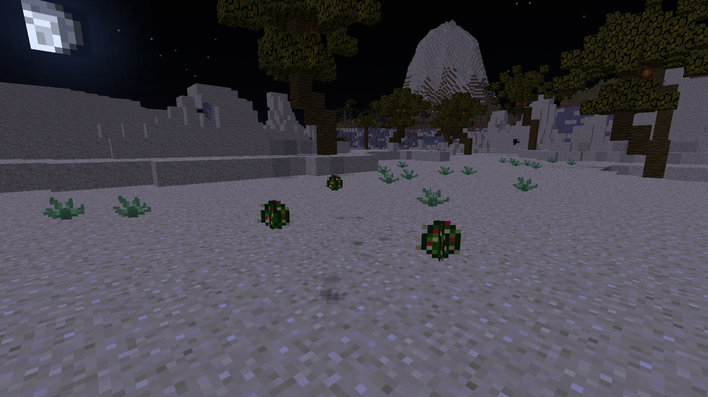

Arid Gardens can only be found in Desert-type biomes. 

Like Cactus, and some other Desert-based plant life, Arid Gardens can only be placed on sand.

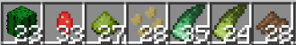

Arid Gardens will give the following:

-Cactus
-Cactus Fruit
-Lentils
-Chickpeas
-Agave
-Sisal
-Cassava

# Frost Gardens
___

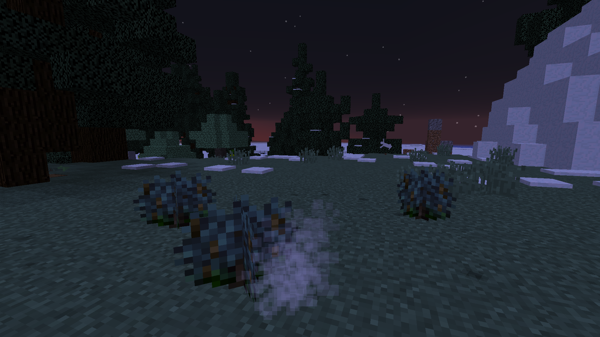

Frost Gardens can be found in Taiga-type biomes. 

Note that they cannot be found in Snow-type biomes, like Snow Plains.

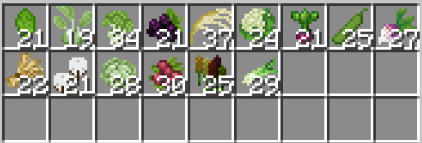

Frost Gardens will give the following:

-Spinach
-Kohlrabi
-Broccoli
-Huckleberry
-Oats
-Cauliflower
-Beets
-Peas
-Rutabaga
-Rye
-Cotton
-Cabbage
-Raspberry
-Quinoa
-Celery

# Shaded Gardens
___

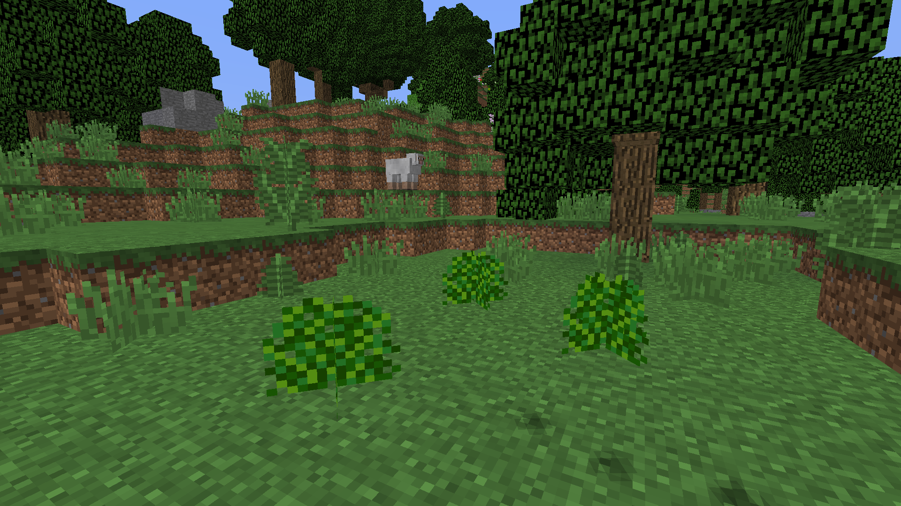

Shaded Gardens can be found in Forest-type biomes and Spooky biomes.

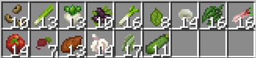

Shaded Gardens will give the following:

-Beans
-Scallion
-Turnip
-Blackberry
-Leek
-Tea Leaf
-White Mushroom
-Spice Leaf
-Rhubarb
-Tomato
-Raddish
-Sweet Potato
-Garlic
-Jute
-Zucchini

#Soggy Gardens
___

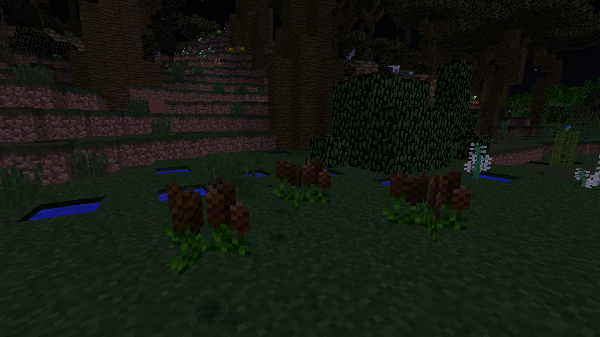

Soggy Gardens can be found in Swamp-type biomes. 

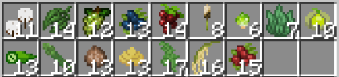

Soggy Gardens will give the following:

-Cotton
-Spice Leaf
-Green Grapes
-Blueberry
-Mulberry
-Millet
-Brusselsprout
-Seaweed
-Okra
-Asparagus
-Water Chestnut
-Jicama
-Kale
-Rice
-Cranberry

# Tropical Gardens
___

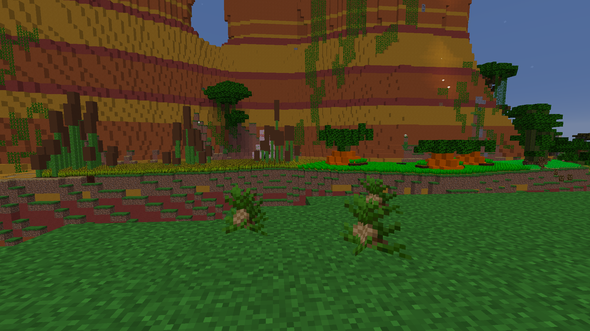

Tropical Gardens will grow in Jungle-type biomes.

This includes biomes in Tropicraft.

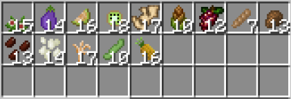

Tropical Gardens will give the following:

-Kenaf
-Eggplant
-Cantaloupe
-Kiwi
-Ginger
-Bamboo Shoot
-Grape
-Arrowroot
-Taro
-Coffee Beans
-Sesame Seeds
-Curry Leaf
-Soybean
-Pineapple

# Windy Gardens
___

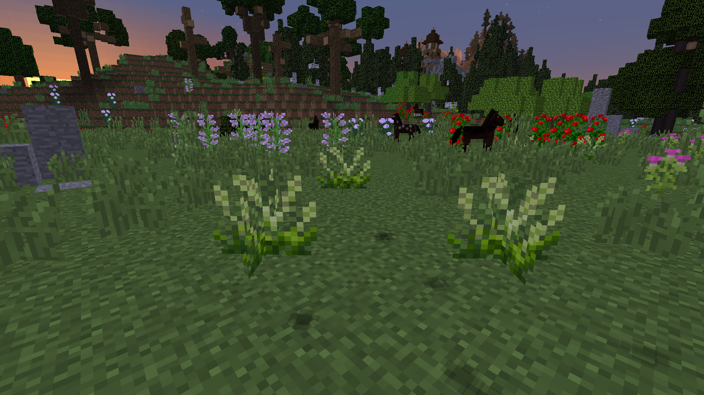

Windy Gardens will spawn in Plains biomes. If it doesn't say Plains in the name, Windy Gardens will not spawn there.

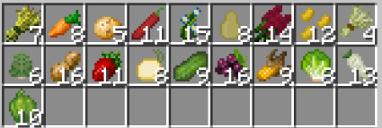

Windy Gardens will give the following:

-Wheat (Vanilla)
-Carrots (Vanilla)
-Potatos (Vanilla)
-Chili Pepper
-Flax
-Winter Squash
-Amaranth
-Mustard Seeds
-Barley
-Artichoke
-Peanut
-Strawberry
-Onion
-Cucumber
-Elderberry
-Corn
-Lettuce
-Parsnip
-Bellpepper

# And that's everything

___

And that covers everything you need to know about Gardens from Pam's Harvestcraft. Now go out there and collect those crops!

