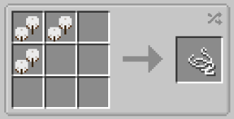

# String sources
___

Several crops from Pam's Harvestcraft can be used to create String.

They are:

-Flax
-Kenaf
-Sisal
-Jute
-Cotton

These crops can all be used to create String with the above recipe. See the JEI menu for help.

Gardens from all biomes have a chance to yield a String crop when broken.

Cotton: Frost and Soggy Gardens
Sisal: Arid Gardens
Jute: Shaded Gardens
Kenaf: Tropical Gardens
Flax: Windy Gardens

