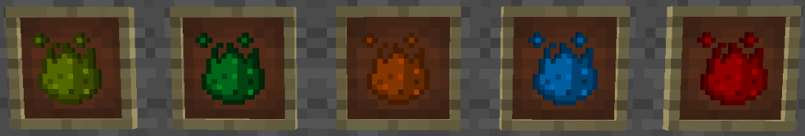
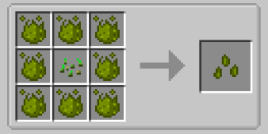
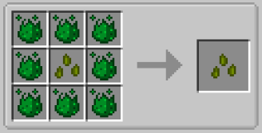
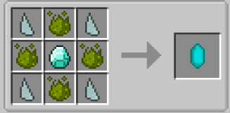
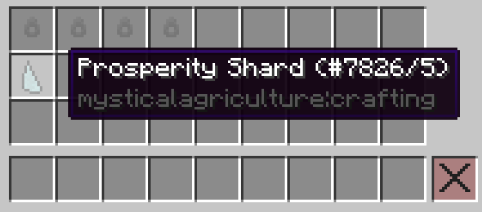
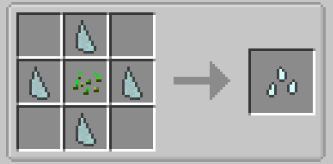
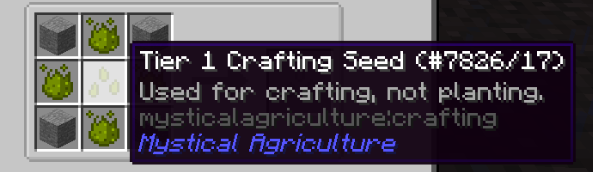
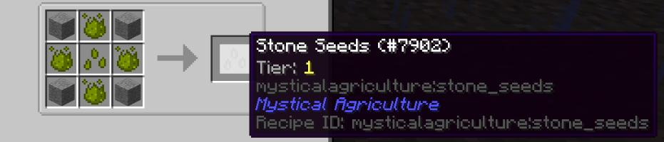
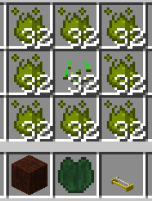

# Inferium Seeds and Essences
___

Inferium Essence has a 20% chance to drop from any killed hostile mob.

Inferium, Prudentium, Intermedium, Superium and Supremium Essences are all used to craft their respective tier of Inferium Seed.

Tier 1 is used with the basic Inferium Essence obtained by killing mobs.

Inferium Seeds can be crafted by surrounding normal seeds with Inferium Essence.

Progressive tiers are created by surrounding the previous tier of seed with the next tier of essence.

Speaking of essences; here is how to progress the power of each essence.

Infusion Crystals are needed to infuse multiple essences into a single more potent essence.

An Infusion Crysal has a limited number of uses, and will break after infusing too much essence.

Once you have obtained enough Supremium, you can craft the unbreaking Master Infusion Crystal.

Prosperity Shards can be found while mining underground. They are used to create Base Crafting Seeds, and will be the foundation for the seeds you'll grow in the future.

Base Crafting Seeds will be needed to create other tiers of crafting seeds. Each tier of crafting seed contains recipes which will allow you to grow valuable resources like Coal, Iron and even Diamonds.

As we can see in this example, surrounding a Tier 1 Crafting Seed with some extra Inferium (Tier 1) Essence, and some stone, will create Stone Seeds.

Stone is obviously a very early game resource. Stone Seeds can easily be obtained early game, as well as several other groups of resources. Check them all out in the JEI menu by searching "@MysticalAgriculture".

Higher tier seeds will require higher tier essence to create the Crafting Seed needed for the recipe. 

Diamond Seeds, being a Tier 5 Seed, will require a decent amount of Supremium Essence to create.
___

# Really getting down to business
___

If you really want to rush through this mod and get to farming for that precious Valonite, here's how to do it.

You're going to need the following:
-32 Seeds
-256 Inferium Essence
-32 Fertilized Dirt (but you're going to want to get more, so you can plant more seeds later)
-2 Lilypads of Fertility (they help tons, but are not required)
-2 Sprinkler Systems

Step 1: Create your Tier 1 Inferium Seeds. You should end up with 32 Tier 1 Seeds.

Step 2: Plant your seeds into your Fertilized Dirt. Make sure they've got light!

Step 3: Place your Lilypads of Fertility somewhere in the middles of your farm. They will need to be placed on a water source block, so you will need to give up a single crop plot for the Lilypad.

Step 4: Set up your 2 Sprinkler Systems to ensure they reach all sides of your farm. Increase the number of Sprinklers as you expand your farm to keep crop growth at a high rate.

Step 5: Step up a collection system. This is up to you. I manually collect all of my crops in my Survival World.

Step 6: Once you've collected lots of Inferium Essence, start turning it into higher tiers of essence. With that, create higher tiers of Inferium Seeds. Higher tier Inferium Seeds will yield more Inferium per harvest.

Note: All tiers of Inferium Seeds will always only yield Inferium Essence. It is simply a higher amount.

