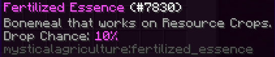

# Your guide to other items
___

Watering Cans are very useful. When used, they increase the growth rate of crops in the area by a certain tick amount.

To make the most efficient use of this item, you should rapidly spam Right-click.

For a less alternative requiring less excersion, you can move around in the area and hold Right-click while looking towards the ground.

Moving around will register each block you pass over as a new Right-click, when Right-click is held down, and automatically uses the Watering Can when you move around; if that makes any sense.

Watering Can cores will require Fertilized Essence. This is obtained at a set chance when you harvest resource crops from Mystical Agriculture.

Coal infused with essence can also be a huge boon, if you have the resources to spare. This fuel will burn with much more potential than regular Coal.

You can also compact your fuel, just like regular Coal, but with a bit of color added.

The Seed Reprocessor can turn your resource seeds back into basic Crafting Seeds of the appropriate tier.

This is for when you decide you want to switch up what you're growing, and have the materials to change the seeds, but not the materials to create entirely new basic Crafting Seeds.

Very helpful in the early game, and even into the late game when you're growing one or two Tier 5 crops and want to switch them around after you think you've gotten enough of whatever the resource is.

