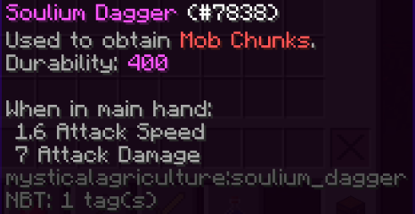
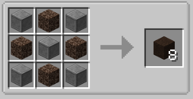
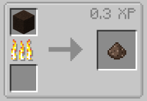
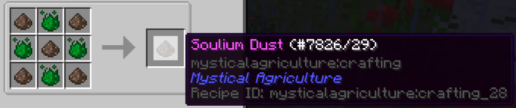
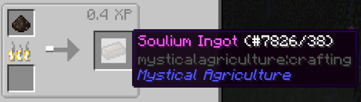
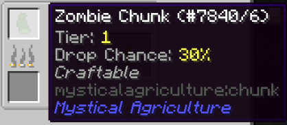
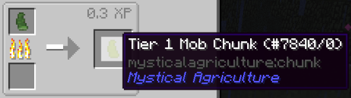
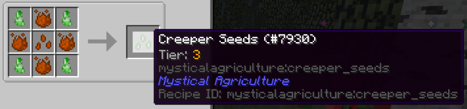

# Little knife, big rewards
___

The Soulium Dagger

This item is the only way to obtain Mob Chunks.

By landing the killing blow on mobs with this weapon, you have a chance to obtain Mob Chunks on the killing blow. The type of Chunk depends on which mob is killed.

Step 1: Craft your Soulium Ingots. Which is a painfully unnecessary process.

Obtain stone (cooked Cobblestone), and Soul Sand.

Cook it.

Acquire Prudentium and combine it with your Soul Dust.

Cook it again. And then you have the Soulium Ingots needed to craft your dagger!

But wait, you're missing the hilt!

You'll need some Prosperity Shards and a Stick.

Combine everything together to finally obtain your Soulium Dagger!

Now you can go and slice down enemies for a chance at Mob Chunks!

Chunk tiers are as follows:

-Zombies are the only Tier 1 Mob Chunk.

-Farm animals come in at Tier 2.

-Overworld mobs at Tier 3.

-Most Nether mobs at Tier 4.

-Wither Skeletons at Tier 5.

You can cook Mob Chunks in order to receive the basic Mob Chunk at whatever tier the monster correlates to.

Here you can see, from a Zombie Mob Chunk, we receive a basic Tier 1 Mob Chunk.

With the basic chunk, we can craft it into seeds for other mobs. However, with Zombie being the only mob you can "grow" at Tier 1, this example is not so great.

In the case with a Tier 2 Mob Chunk, you could use the basic chunk to transition Sheep Chunks to Cow Chunks

Note: Each chunk also has its own special drop chance.

As you can see here, we are trying to make Creeper Seeds.
 
Take notice that Creeper Seeds require Intermedium Essence to be crafted.

Creeper Seeds are a Tier 3 seed and will require the third tier of essence to be crafted.

This goes for all seeds and their tiers, respectively.

