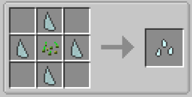
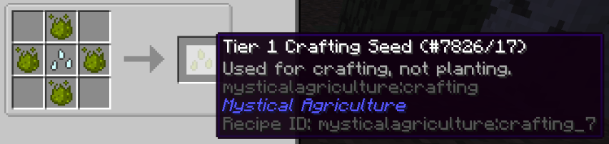
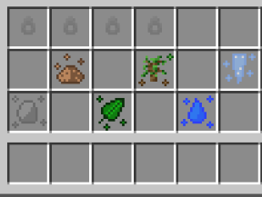
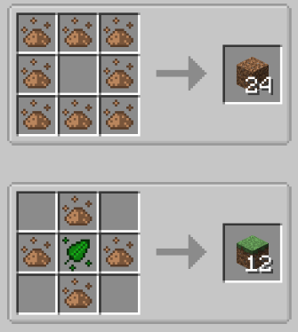
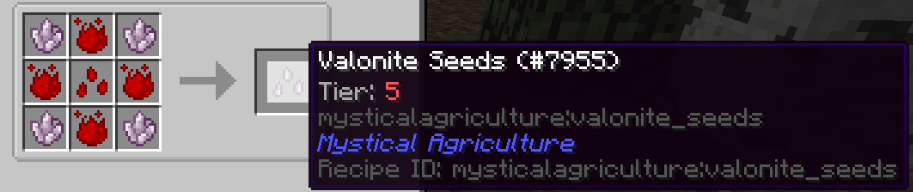
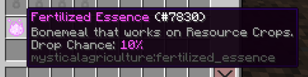

# Resources and how to grow them!
___

# Just a beginner
___

You can grow a plethora of different resources using Mystical Agriculture.

In the previous section, you went over how to obtain essences and increase their potency. In this section, you'll review the details on how to turn these essences into seeds that will grow you valuable resources.

Crafting Seeds will come in several tiers, up to Tier 5

The Base Crafting Seeds are required to start and upgrade seeds from Tier 1.

Tier 1 Crafting Seeds will yield essences when harvested. These are not normal essences however, and are used in certain recipes to create their respective resource.

Here we can see the essences we can gather from Tier 1 Crafting Seeds.

Essences can be combined to create things like dirt, or grass blocks. Other resources like stone, and even coal can be created from these essences.
___

# Getting serious
___

You'll eventually be able to craft seeds which will grow valuable materials.

Some crops do not yield essences. In the case of most ore crops, the ore itself will drop when the crop is harvested.

Fortune can affect these drop rates under certain circumstances. 

When crops are destroyed by a tool enchanted with Fortune, there is a chance to receive double seeds and double harvest back from your crop, to the detriment of you having to replant your crops every single time you do this.

In the long run, it is much more efficient to set up a sustainable farm which will bring you continuous yields of essence, from Inferium or Crafting Seed crops.
___

# Fertilizing Mystical Crops?
___

You may have been wondering why regular Bone Meal doesn't work on Inferium, and this is intended.

In order to fertilize crops from Mystical Agriculture, you'll need to obtain Fertilized Essence. 

This item has a 10% chance to drop when harvesting the yield from any resource crop.

Fertilized Essence can be used like Bonemeal on crops from Mystical Agriculture.

It can also be used to craft other misc. items from the mod. See Misc. Items section for more information.