# The Kitchen and how it works!
___

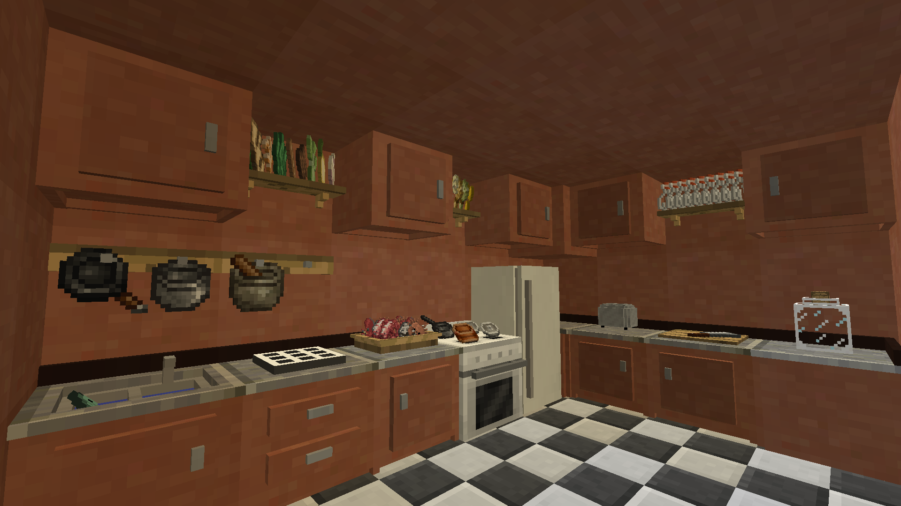

Note: For the sake of shortening the mod title "Cooking For Blockheads", we will call kitchen items "Kitchen-Aid".

The Kitchen can be complicated, but it doesn't have to be!

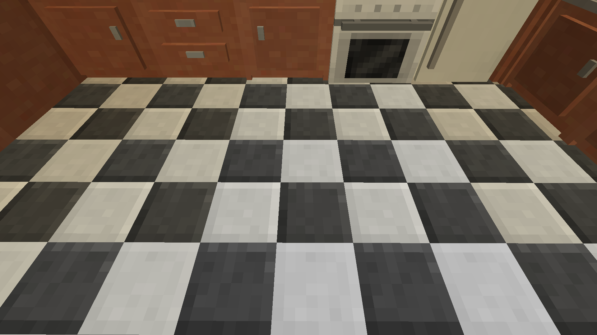

If we're going to be short here, Kitchen-Aid on the ground should be connected by Kitchen Floor if it is not connected to the largest portion of your food storage.

Many portions of your Kitchen-Aid set can be used to store food in the first place.

This being said, in order to link the inventories of storage blocks to your food crafting stations, you must have each block touching eachother, either side to side, or diagonally.

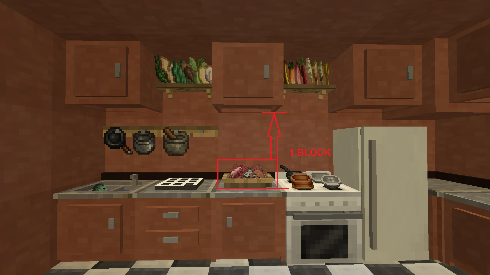

In the case of Kitchen Cabinets, the block will need to be one to two blocks above your station. It does not seem to work when it is placed outside of a certain range, but will link inventories when close to another station or Kitchen-Aid storage block.

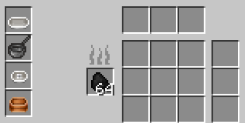

In the case of the Cooking Oven, you will need to power it with Coal. However, if the inventory link between the Cooking Oven and other storage blocks seems strange, here it is in short detail.

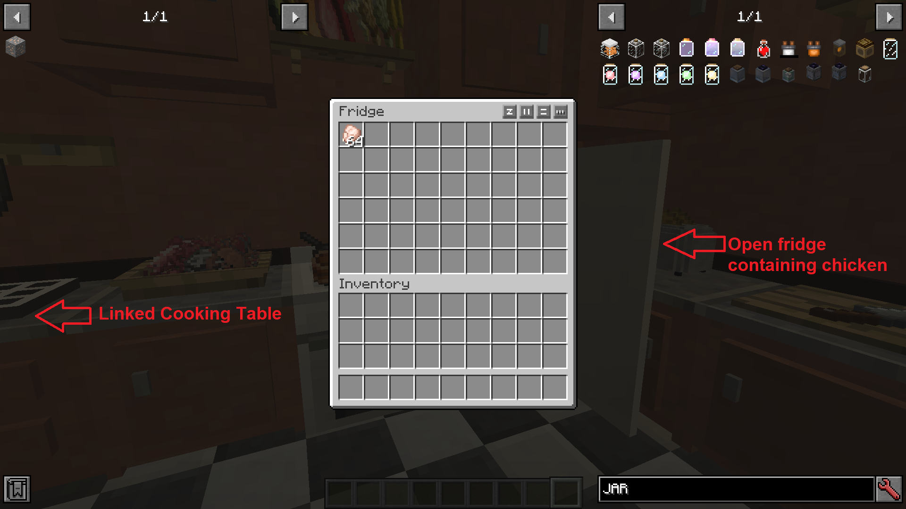

There is indeed Raw Chicken in this Fridge... so I must be able to cook Chicken.

![Chicken.. Yes][chicken.png]

As long as it has fuel to burn, you can craft everything you need at the Cooking Table. If there is fuel in the Cooking Oven, and Raw Chicken in a linked storage block, the Cooked Chicken recipe should appear in the Cooking Table. Click it once to select the recipe. Further attempts will move the Raw Chicken from where ever it is to the Oven to be cooked.

The Cooked Chicken must then be manually moved or can be used straight out of the Oven for other recipes, from the Cooking Table.

Note 2: As long as inventories are linked, you can do anything from just about anywhere in your Kitchen!

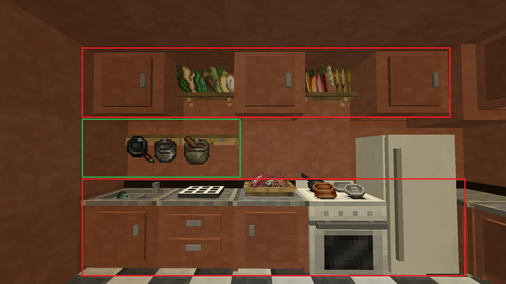

Note 3: ALL Kitchen-Aid items will link invetories together.

As seen in the basic picture above, all blocks are placed on Kitchen Floor. This will link all ground block inventories together.

However, you also see racks above the ground blocks. These will link the Kitchen Cabinets, in the event the Cabinets do not link themselves (as they link one to two blocks above other Kitchen-Aid blocks). Think of the racks as a precautionary measure to ensure all inventories are totally linked.

This way, you never miss out or forget about any ingredients you have on hand!

With how big cooking is in this modpack, the kitchen shown in the example is NOT going to cut it for you, if you really enjoy cooking.

Seek solutions on how to make an enormous kitchen that is still aesthetically pleasing!

# Kitchen tools and utensils
___

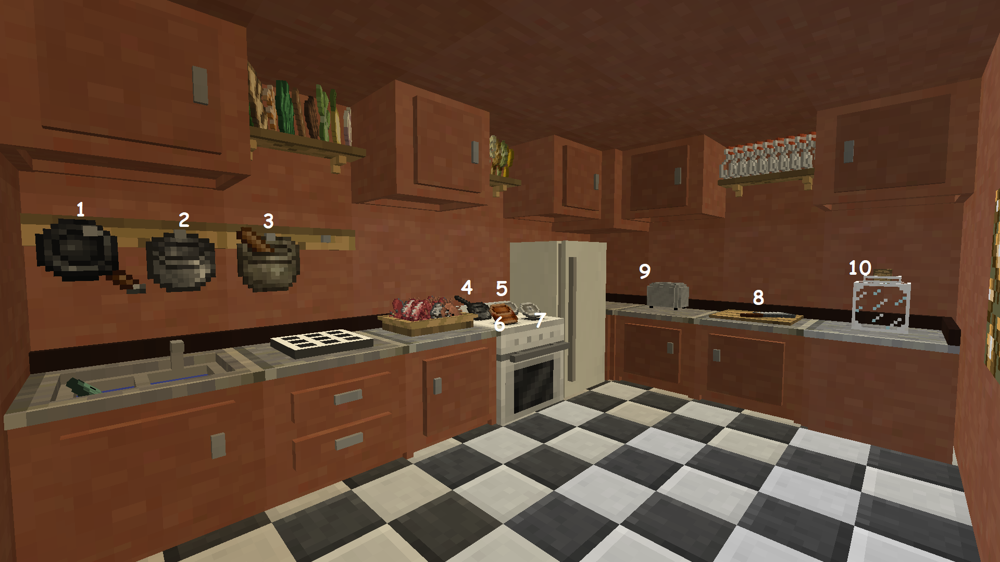

The kitchen contains several tools that you're going to need to craft and keep on hand. You never have to have them in your inventory, if you've made a kitchen to begin with.

Kitchen tools can be used from Kitchen-Aid storage blocks or from Tool Racks connected to your kitchen inventory.

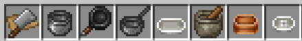

The kitchen tools shown are named from left to right:

-Cutting Board; this item can be placed as a decorational item, on top of a block; the usage of the tool will be linked

All other items must be stored in a linked inventory, or on a rack (this is also a linked inventory).

-Pot
-Skillet
-Saucepan
-Bakeware
-Mortar & Pestle
-Mixing Bowl
-Juicer

There are 8 kitchen tools in total.

2 other items may be counted as tools.

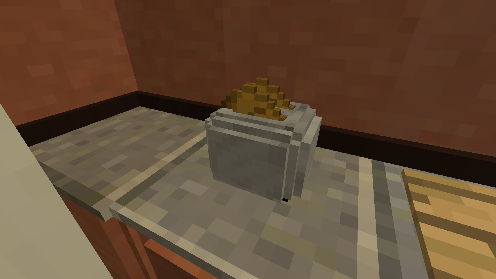

The Toaster is used to manually toast bread. It is a slower process than putting Bread through a furnace. It is a nice decorational item. The Toaster will give Harvestcraft Toast.

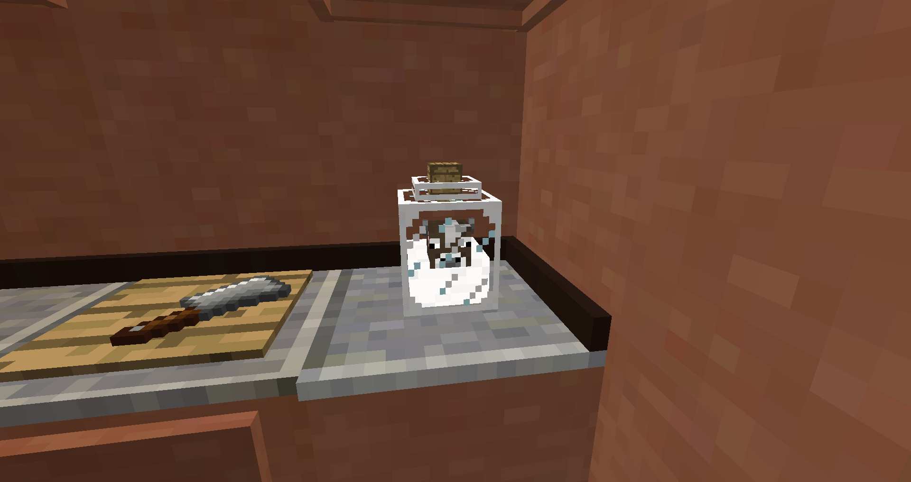

The second item, Cow in a Jar, will provide Milk to recipes which need it when it is on top of or linked to a Kitchen-Aid block. The Milk Jar will only store milk, so it seems.

It may sometimes be recommended to create multiple Cows in a Jar in order to create more milk. 1 bucket = 1000ml of milk.

# Upgrades? For Kitchen-Aid? Waaaaaaaaaaaaaaaaaaaa
___

To use upgrades, Right-click the respective station.

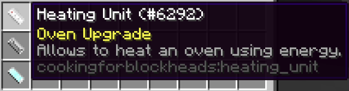

This upgrade allows you to power your Cooking Oven using FE energy, saving Coal. You can power your Cooking Oven with a Spectre Disc, or a Battery, or any other form of energy connection you can come up with.

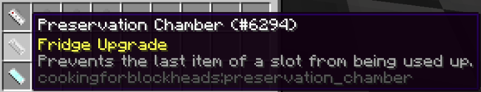

This upgrade will preserve ingredients down to 1 item in whatever slot is being extracted from.

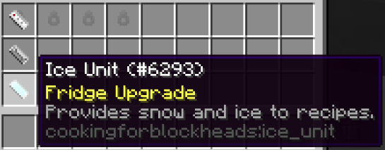

This upgrade will allow your Fridge to produce Snow and Ice for whatever recipes require it.

E.g - If there is 1 stack of Heavy Cream and 1 stack of Salt, and you make Butter, this upgrade will prevent you from using all 64, and only permit you to make 63 Butter from your Cooking Station.

Convenient for quick-depositing items into your Fridge if you find yourself manually sorting oftens more than not, like myself. 
