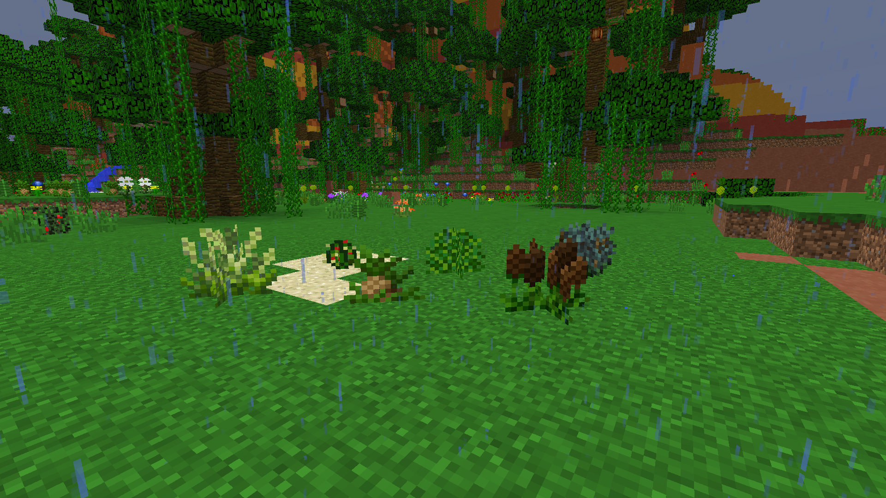
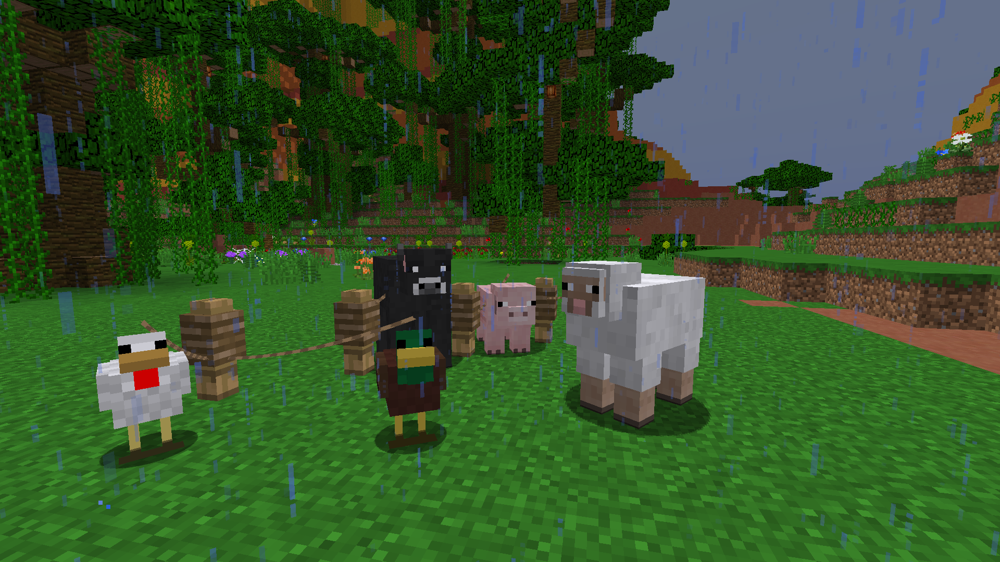
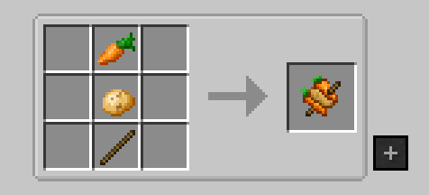
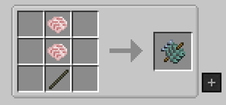

# What's for dinner?

Your first task is finding something to eat!

Something sustainable, to be more precise.

Something you'll be able to obtain with relative ease over and over again.

Gardens are one type of food source players will encounter early on in the game. These gardens from Pam's Harvestcraft will contain random fruits/vegetables for you to eat or grow. In order to turn the food into a plantable seed, simply place it in your crafting grid and extract the result.

Alternatively, players can purchase certain animals from the Shop after earning gold from completing quests.

Skewers can also be an easily accessible source of food for early game players. While the meat variations may be slightly more expensive, Veggie Skewers provide an easy source of tons of hunger and saturation.

Fish Skewers are another great source of good eats. Players can use fish from mods within the pack to craft these skewers. With Aquaculture, certain fish will give a higher number of fillets depending on the size or rarity of the fish!

This allows for you to craft several skewers from only a handful of fish and saves time farming for food in a fresh run.