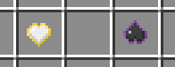
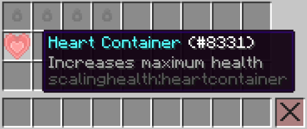

# The World doesn't stop just for you!

The difficulty of your world will gradually increase until reaching 250.

Difficulty is increased by several constant and several addititive variables. 

The farther you are from spawn will increase difficulty at a faster rate.

Mobs killed will also increase difficulty.

As difficulty increases, the health and damage of mobs as well as the chance to spawn Blight mobs does too.

Enchanted and Cursed Hearts can be used to decrease or increase your worlds' difficulty. They can be purchased from the Shop. Controlling the difficulty of your world is not intended to be easy, and these hearts will cost a pretty penny.

Purchase them with gold earned from completing quests!

Heart Containers can be created by combining Heart Crystal Shards in your crafting grid. See the JEI menu for recipes.

These hearts will increase your maximum life by 1 full heart each and will require some experience levels to consume.

Also, the maximum HP is something ridiculous, so don't worry about getting too much health.

Heart Crystal Shards will drop randomly from killed enemies, and can be found rarely as ore deposits underground.

