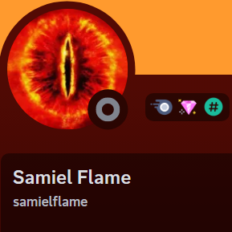

Rad 1 Credits

The official Team Behind Roguelike Adventures and Dungeons 1(W.I.P)

#Lead Pack Developer

The lead developer of Rad and multiple modpacks without dreams01 this modpack would not exist.
A special thanks from all members behind rad 1 for allowing us to help with this modpack and others he publishes.

#Lead Revamp Developer

The main developer of the revamped quest system and mechanics used in rad 1.49 
Mastarin dedicated a lot of time to overhauling all quests used in the modpack and the rewards behind them.
Without their help this process would have taken a much longer time.

#Script Maintainers

Major contributors to multiple of the scripts used in the modpack.
These scripts are used to add new mechanics, recipes and patch bugs within the modpack.

#Modpack Optimization 

A Major contributor in helping with the modpacks performance and optimization.

#Builder & Github Maintainer

The lead maintainer of Rad 1 github a special thanks to them for keeping track of multiple issues and fixing issues related to the modpack. 

As well as submitting all current builds used in the Amazing Architects.

#Config Overhauling & Quest Contributor

Made multiple balance changes and overhauls to different mods configs allowing for them to be more organically challenging.

Assisted with the development of multiple quests.

#Modpack Balance

Assisted with information in regards to allowing the modpack to be more balanced.
