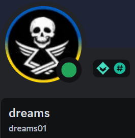

Rad 1 Contribution Credits 

Total Approximate Hours of Development: 2000+ hrs over the course of 2 ½ years of active development. 

Please be sure to thank your nearest RAD developer in the Discord!

The official team behind Roguelike Adventures and Dungeons 1

#Lead Pack Developer

The lead developer of RAD and multiple modpacks; without Dreams01, this modpack would not exist.

Development Team: “A special thanks from all members behind RAD 1 for allowing us to help with this modpack and even others you publish!.”

#Lead Revamp Developer

The main developer and kickstarter of the RAD Revamp; revamped the quest system, 

-Introduced balancing changes

-New quality-of-life recipes, and pushed for the addition of many new mods you see in the pack today, 

as well as assisted the development team with conceptualizing new mechanics and systems now used in RAD. 

Mastarin dedicated a lot of time to overhauling all quests used in the modpack and the rewards behind them.

Without their help, this process would have taken a much longer time, or may even still be a WIP today

Personal note from Mastarin to the RAD community: “The immense contributions and the increased sense of community within the development team formed by the kickstarting of the Revamp is something I take great pride in. 

The Revamp would not be what it is today without each individual member of our team having done their part. 

Please be sure to thank them in Discord!” 

#Script Maintainers

Major contributions through scripting, config changes and extensive gameplay and bug testing during development.

Without him, we would have had a much harder time figuring out what works and what doesn’t.

Developer of multiple new scripts used in the modpack, not limited to brand new mods and additions for use exclusively in RAD.

Bizzoula has helped shape certain visions which were previously only dreamt of. 

This individual provided work which other individuals were not capable of. We were truly blessed to acquire his assistance during development. 
Give him a special thanks in the Discord!

#Modpack Optimization

A major contributor in helping with the modpacks performance and optimization. 

Created multitudes of pre-generated worlds throughout updates. 

Conducted experiments with the objective goal of creating a more optimized user experience. 

Without him, many players may have struggled to play this modpack due to the limitations of their PCs.

#Builder & Github Maintainer

The lead maintainer of Rad 1 GitHub. A special thanks to them for keeping track of multiple reports and fixing issues related to the modpack. 
Also provided occasional configuration changes when necessary.

Sole contributor of all current builds used in the Amazing Architects Chapter. Without Samara, we would not have a basis of content for this feature which was only dreamt of working in the past. 
Check out their builds in the Questbook and be sure to submit your own!

#Config Overhauling & Quest Contributor

Extensive changes and overhauls to the configuration and balancing of the modpack to produce a more organically challenging experience. 
Without them, we’d probably still be fighting Zombies with 2,000Hp. 

Assisted with the development and concepting of multiple quests, especially after the discontinuation of Mastarin’s ability to aid the development team. 

A message from Doctor Mage “If you get all the references I’ve made in quest and starting gear you earn a free cookie :3.”

#Modpack Balance

Provided an agenda for the development team by consistently reporting priority bugs and issues.

Without their contribution, many quests may have had issues for extensive periods of time, posing an inconvenience to players. 

