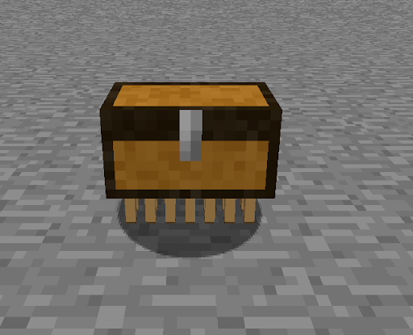
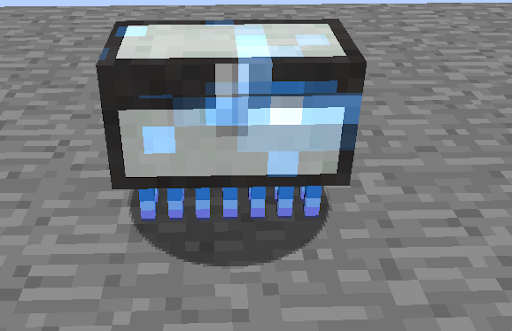
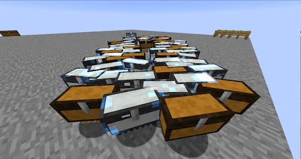

The cutest form of storage you will ever see luggage are little walkers that can store 27 items when not upgraded

They are also pretty cheap to craft 

They are also near immortal beings impossible to kill through normal means so no worry about them getting destroyed while you're fighting a dragon.

Upgrading them is pretty simple, just hit them with anything that causes thunder (electric spells from electroblob’s wizardry or engraved thunder to name a few).

To pick up your luggage just sneak click on it and it will turn it into an item don’t worry it will keep all the items you stored it in when it’s picked up.

Also remember you can never have too much luggage!

