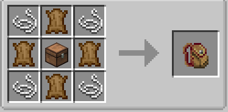

Backpacks

A staple item of modded minecraft backpacks are one of the cheaper options when it comes to mobile storage crafted with following items (Remember to use jei to see how to craft certain items).

Crafting this will give you the most basic Backpack with a total of 18 slots fret not this can be upgraded with the following set of items

Storage upgrades being 5 tiers each one adding 9 slots to the backpack and very cheap to make allows for you to easily get a maxed backpack before you even halfway into your first dungeon.
But be warned you cannot skip upgrade tiers each upgrade has to be added in order
Wood > Stone > Iron > Gold > Diamond.
A max upgraded backpack supports storing 63 items which unsurprisingly is most likely not enough to store all the loot you're getting while plowing through a dungeon (you can always carry multiple).
