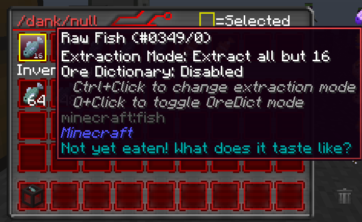
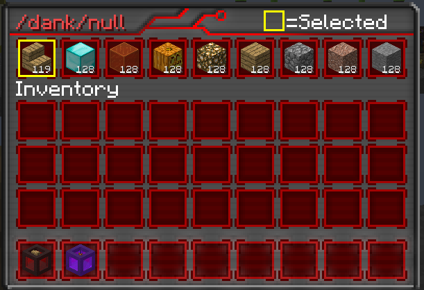
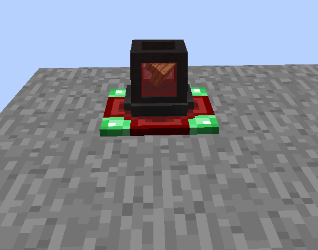
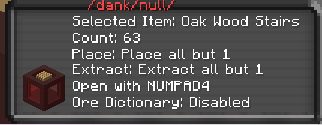

Did you ever think to yourself what if drawers were portable but also worked like backpacks?

Introducing dank nulls combing the item stacking size of storage drawers with the portability of backpacks.

Dank nulls have similar features to drawers; most notable is that it’s able to save the item stored in a specific slot as well as pickup that item and store it inside itself.

Backpacks do have some advantages over dank nulls and vice versa each null can only hold a certain stack size of any item if it collects any more it will void that item this makes it great for mining in caves and getting rid of any excess amount of cobblestone.

Another utility is that any blocks stored inside can be placed depending on what mode you set the dank null to.

Docking Station

![Docking Station Recipe] (nulldockstation.png)

Unlike backpacks nulls cannot be placed to place them down in the world you have to place them on a docking station this allows the null to act like any other placeable storage block.

Nulls can also be opened while in you inventory or have the selected item/block cycled through but you have to bind keys to use this features.

#Warning: Don’t store dank nulls inside of other storage inventories it can lead to issues!!
