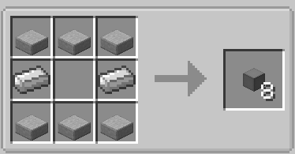

#READ THE ABOVE GUIDE BEFORE CONTINUING HERE

If you’ve looked at all the other guides you’ll realize there is one simple thing missing and issue at some point you're going to have to return to your base to return all your loot which interrupts all the time you could have for looting or raiding dungeons.

Don’t worry adventurer there’s a solution to that being the mod simple storage network as its name implies it’s a simple mod that adds a way of remotely taking items or storing items while on the go but it does require some setting up before you go running off and there are other factors to take into account.

#For future refrence simple storage network will be shortened to SSN

The brain of the system every simple storage network needs one before it can even work 
It keeps track of the following
How many slots are not being used in a chest
How many wires are connected to it
If a request or inventory cable is connect to it

Storage Inventory

This is needed so you can access items while interacting with the network master it's attached directly next to the master

Storage Request Table

The request table allows you to craft items while accessing the network from it, it must be connected to the master either directly or with cables.

Now for the fun part connecting all your chest to your ssn

One of the following cables must be attached to the inventory you want to access from your storage network master; the most basic one is purple (recommended if you don't plan on doing anything complicated with your ssn).

So your ssn has no issues and you dont cause any issues for yourself. Only one colored cable needs to be attached to any inventory(An inventory is any block that can store items) to connect coloured cables between each other. One must use storage cables.

Remotes
The final part of the ssn guide you’ve probably been wondering how the heck do you access this if it’s all at your base here’s were storage remotes come in

(ignore the ones highlighted in red their useless)
To connect a remote to your ssn simply just click the network master with the remote and it's connected.

This allows network access from any distance in the same dimension the only downside is unless you want to setup an ssn in each dimension along with there own remote you will end up having to store items from other dimensions in your base; Just kidding that's were the Advanced Storage remote comes in aka (Upgraded Storage Remotes cooler older sibling).

This allows for access to your ssn from any dimension and any distance.