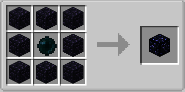

#MAJOR INFORMATION

#Chunk Loading

For your simple storage network to always be active even when your in other dimensions or not at your base it must be chunk loaded (chunks are a system that are way to complicated and long to explain in this guide but in simple terms it's a 16x16 area of any minecraft world that goes from bedrock to y256 to see the chunks around you either press f3 + g will show chunk borders or f9 which shows chunk borders or regions.)

But there are solutions to this that being chunk loading blocks or methods the easiest and simple method is the block literally called a chunk loader ( their are also spot loaders or ender anchors)

Another method is by placing an ender anchor in the chunk

The chunk loader will keep the chunk loaded as long as you are in game

#Warning:NEVER HAVE YOUR SIMPLE STORAGE NETWORK IN MULTIPLE CHUNKS ESPECIALLY IF THEY ARE NOT BEING CHUNK LOADED.