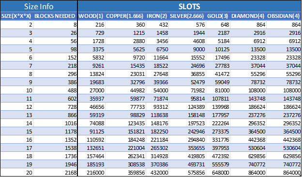
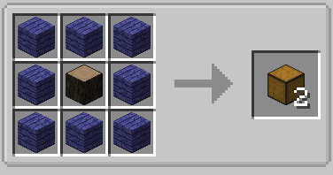
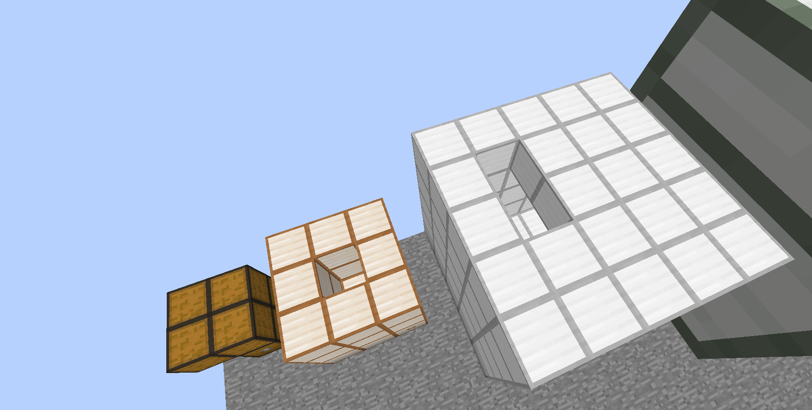
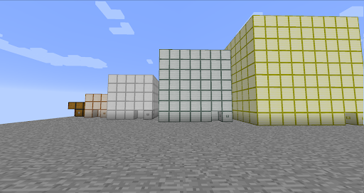
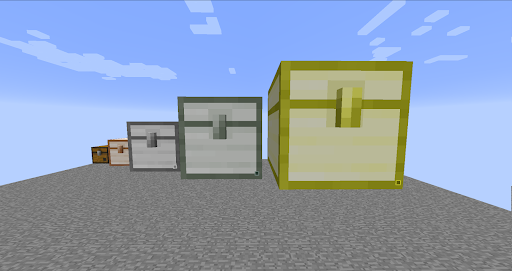
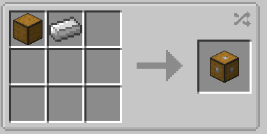
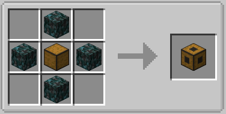
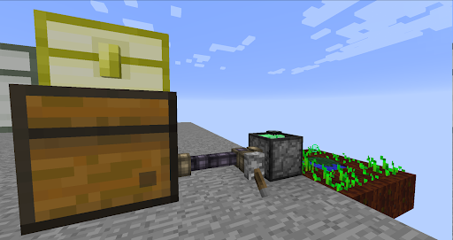

The largest storage item in the modpack crafted as a multiblock structure with a hollow core depending on the size and material of the chest it can store a whooping 864k items.

#Warning chest larger than 10x10 may cause issues with performance

Colossal chest are made up of 2 or 3 multi-blocks

The wall

The main part of the chest forms all the multiblocks that will make the chest recognise itself as being connected to the core.

The Core

The core is the main part of any colossal chest and is a requirement for it to work. It acts as the brain of the system and keeps all items inside.

#(WARNING:UNDER NO CIRCUMSTANCES DO YOU EVER DESTROY THE CORE. IF PART OF THE WALLS ARE BROKEN BUT CORE IS LEFT INTACT IT WILL KEEP ALL ITEMS BUT IF THE CORE IS DESTROYED WHILE THE CHEST IS UN-FORMED ALL ITS CONTENTS WILL BE VOIDED.)

The Interface

The interface block allows for pipes to be connected to the chest normally used if you have the chest connected to some sort of farm

