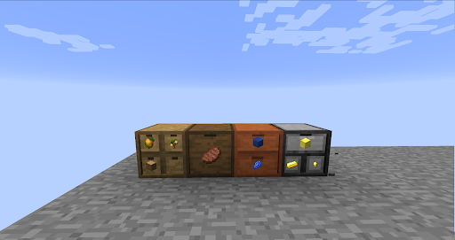
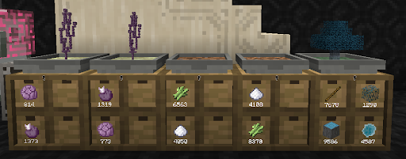
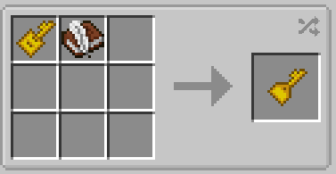
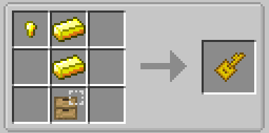
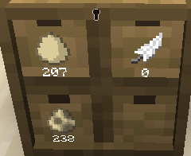
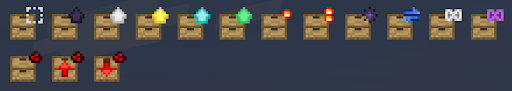
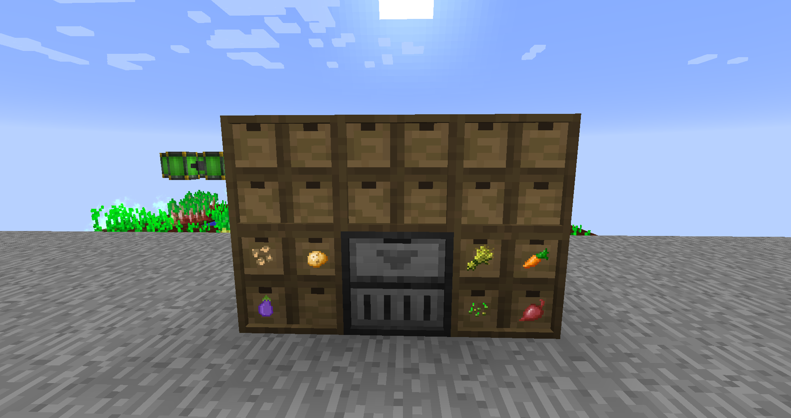

Storage Drawers

The best solution for storing a single item or sets of items Storage drawers

In order from left to right

Basic drawer 2x2  un-upgraded is able to hold 8 stacks of any item (512)
Basic drawer single un-upgraded is able to hold 32 stacks of any item (2048)
Basic drawer 1x2 un-upgraded is able to hold 16 stacks of any item (1024)

Compacting drawers are a unique type of drawer better used for ore blocks that can output the item into other simple craftables it can be turned into as shown above gold into ingots,blocks or nuggets.

Drawers have many uses a simple one being is adding them below a hopping bonsai for it to collect items

Drawer keys  
4 types for the basic drawers the two I recommend are
Quantify key so you can keep track of how much of any item a drawer has

Drawer key locks the contents of a drawer so that it can only store the items that are locked into it (also has the added benefit of showing which items are locked in even if all are taken).

Depending on what you use it for you might find your drawer filling up fast don’t worry there are upgrades to help with that.

At most you only need one Storage upgrade V (the emerald one) and you never have to worry about item storage again. It increases storage by 32 multiplied by the default amount of the drawer. For example 2x2 would store 16k items with just one emerald upgrade.

There are other upgrades that can give uses for different purposes.

Drawer Controller a unique type of drawer any item piped into it will be auto deposited into any drawers attached.

