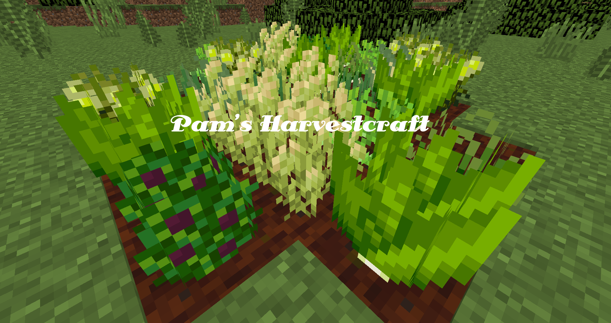

# You're a real farmer now!

Pam's Harvestcraft features over 50 different new fruits and vegetables. It's probably a bit more than that, actually.

But, how many of these fruits and vegetables are actually useful? Well, all of them!

Each new food item has multiple different recipes it can belong to. Depending on the recipe you're after, the crops you grow are entirely up to you!

However, there are a handful of ridiculously useful plants that will help you along the way in the early game, and even the late game.

We will go over them in this guide.
