# The best crops
___

1 - Dye Seeds

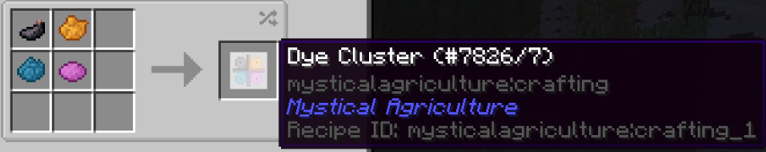

You will need some Dye Clusters in order to craft the seeds.

The dyes in the recipe are required to craft these clusters, unfortunately.

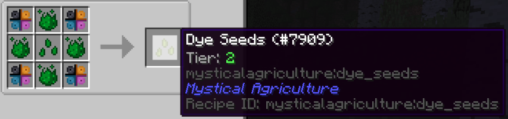

Afterwards, you can combine everything together with some Tier 2 Prudentium Essence to create Dye Seeds.

With these seeds, you can craft every basic colored dye. With each basic color, you'll be able to craft all of the different combinations without ever having to hassle yourself with gathering flowers!

Be sure to check the JEI menu for assistance with crafting Dye Essence into different colors.

2 - Cow and Sheep Seeds

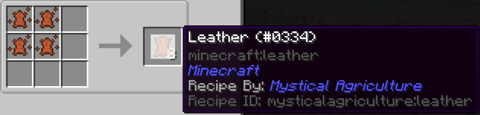

Cow Essence can be turned into a good source of Leather without the hassle of having so many cows taking up tons of space around your base.

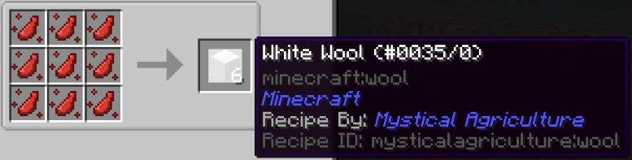

Same goes with Sheep Essence, which can be used as a reliable source of Wool.

You can use the Wool to build, or break it down into String for other recipes.

3 - Zombie and Skeleton Seeds

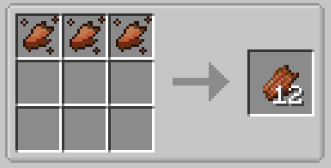

Zombie Essence can be a decent source of Rotten Flesh. Rotten Flesh is used in several recipes including creating Leather, and certain low level foods. 

However, the most important and often overlooked use of Rotten Flesh is the creation of Fertilized Dirt. Fertilized Dirt, as it stands, is the most powerful block to grow crops on; but the crafting of the block becomes relatively expensive in massive quantities.

This is where your naturally sourced Rotten Flesh comes in!

Skeleton Essence is a great source of Bones for the few important recipes that require actual Bones, instead of Bonemeal or something else.

It is not likely you'll need to grow tons of this crop, but this is not the most valuable recipe from this essence either!

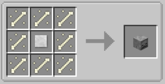

Skeleton Essence can also be used to create Skulls.

Skulls can be placed atop Guardian Altars (DungeonTactics), or use in other important recipes like Graves and Tombstones as well as the Monster Masher from Prefab.

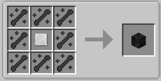

Once you've acquired access to Tier 5 resource seeds, you'll be able to grow Wither Skeleton Essence and combine it with Blank Skulls to create a reliable supply of Wither Skeleton Skulls.

4 - Guardian and Ghast Seeds

Two of the most elusive creatures in this pack; you're definitely going to want to stock up on these supplies.

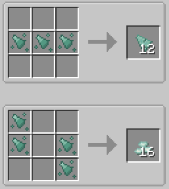

With OTG, Oceans may not be visible for thousands of blocks from spawn. To alleviate this problem, if you can obtain even the slightest amount of Guardian materials, you can start your resource farm.

Guardian Essence can be used to craft both Prismarine Shards and Crystals!

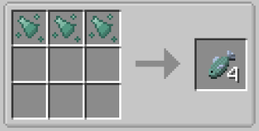

You can even craft Fish with the essence!

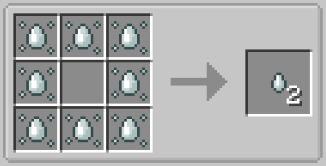

Ghast Essence is one way to farm Ghast Tears.

Being important in the usage of several powerful recipes, as well as Alchemy, this is one handful of seeds you're going to want.

5 - Blaze Seeds

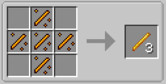

I shouldn't even have to explain the important of Blaze Rods. Especially in this mod pack. They're used for tons of important and powerful recipes.

6 - Important Ore Seeds

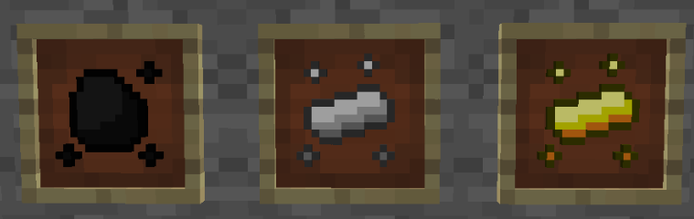

Coal, Iron and Gold are all important seeds to grow if you can get your hands on a nice plot of land to grow them. They will turn into an important source of basic materials for you.

The amount of Coal, Iron and Gold you will go through in this modpack in the long-term is absolutely understated.

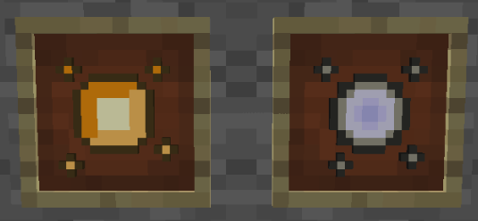

Rare materials like Amber and Quicksilver should also be grown in bulk if possible.

These items are very supplementary to mods like Thaumcraft. Amber also makes for a nice aesthetic block.

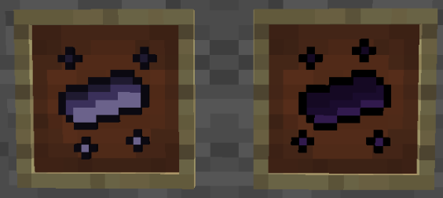

Thaumium and Void Metal Ingots always create Vis when smelted in the Crucible.

Growing them organically circumvents the issue of creating fallout from the Crucible.

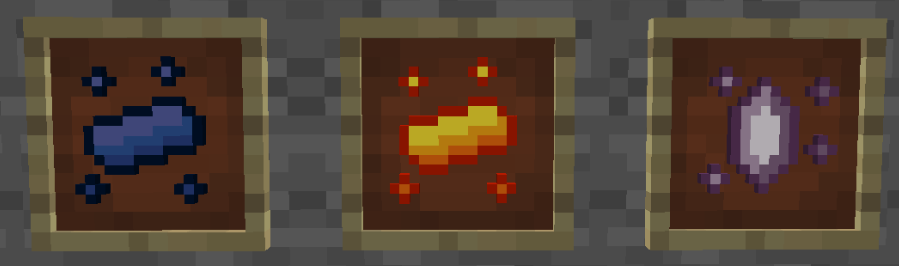

Minerals from The Betweenlands should be grown as well. The Betweenlands underground ore density is not particularily good.

The materials gained from growing these seeds should grant a substantial benefit to your resource pool.

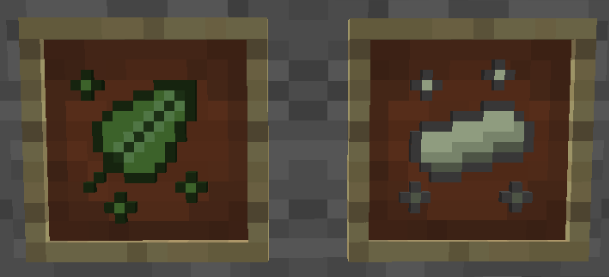

Materials like Steel Leaf and Knight Metal from Twilight Forest are not abundant; Steel Leaf actually only comes in limited quantites by finding it in chests in the Twilight Forest.

Growing these two materials should help you gain a good handful of each item until you're satisfied with your stash. 

Steel Leaf makes for a great fall-back for armor when you need to repair your main set, or you've died and need to recover items from your grave.

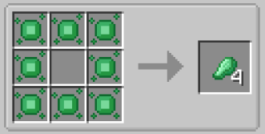

Jade, being as ridiculously rare as it is, should also be grown as a nice supplement to your resource pool.

The Erebus and it's plethora of bugs never give up on trying to kill you as you dig your way to find this previous green gem, so why should you give them the time of day when you can grow your very own in your backyard!

