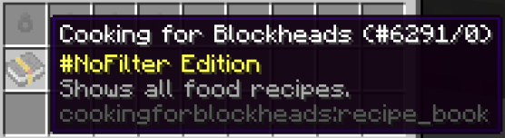
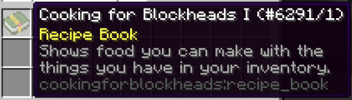
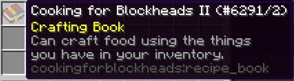

# Grandma's cookbooks
___

The first cookbook you'll obtain will show you all of the available cooking recipes. 

That's it. 

Get back in the kitchen!

The second cookbook will show you all of the recipes you can CRAFT with things in your inventory.

That's it.

Back to the kitchen!

The third cookbook will show you all of the recipes you can craft with items in your inventory, and will allow you to craft them out of your inventory.

This is slightly limited, as you cannot cook food from your inventory. 

This cookbook limits to you preparing items up to the 9x9 grid, and only with items you already have available, or which you can craft out of your inventory.

So you should still stay in the kitchen after all!