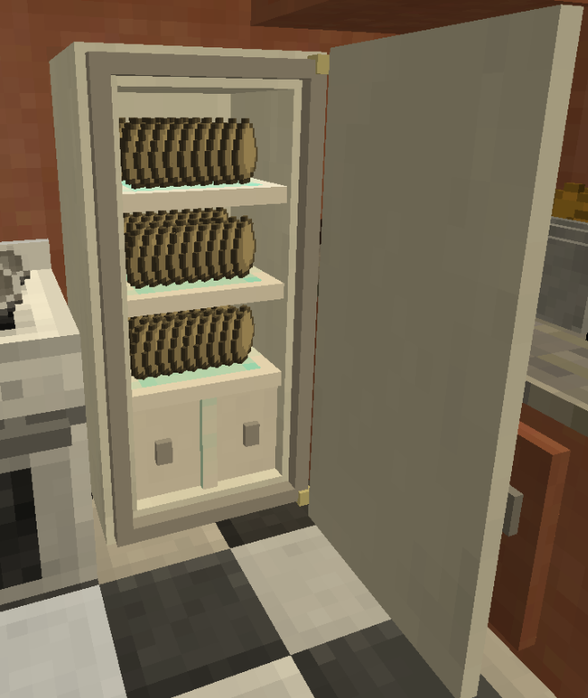
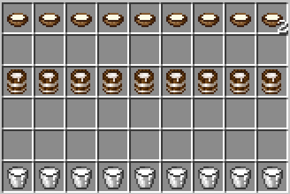
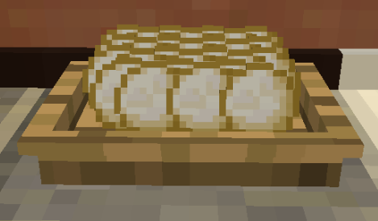
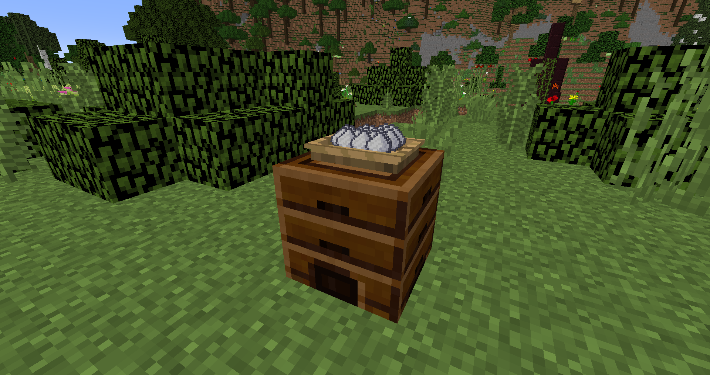
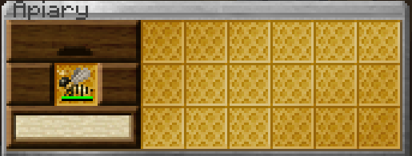
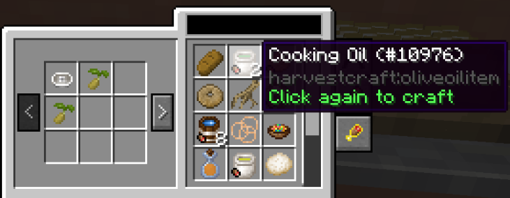
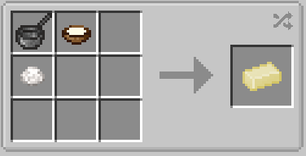
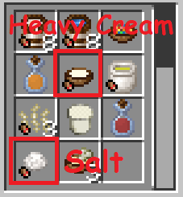
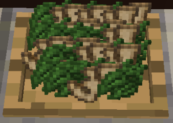

# Ingredients to stay stocked up on!
___

# Eggs
___

Eggs... Eggs... More Eggs!

There are several ingredients which go through high intensity use in the kitchen. You're always going to be busting this item out of the cabinets for that next meal.

In order to alleviate your stress when you find that you're low, this section of the guide will help you stay stocked up on your most important cooking materials!

# Milk & Heavy Cream
___

If you've reviewed prior sections of this Guide, then you'll know that you can obtain an infinite supply of Milk. Make sure you have that.

Heavy Cream is another important ingredient as both Milk itself and Heavy Cream are used in a plethora of recipes, including other basic ingredient recipes.

# Dough
___

I can't explain how important it is to stay stocked up on this item. I'd say atleast 30% of all prepared foods in Pam's Harvestcraft will require Dough in some form or another. Be sure to keep some in the fridge for later!

Dough is also used to create Batter for other recipes!

# Sugar & Honey
___

These two ingredients can be largely used interchangeably, but there are some recipes which will require only honey.

Honey is gathered by finding Queen Bees in Bee Hives out in the wild. You will then placed your Queen Bee into an Apiary from Pam's Harvest to farm honey and other bee related items.

After the Queen Bee is just about used up, it will release another Queen Bee it it's stead IF THERE IS ROOM IN THE APIARY.

Keep this in mind, as there have been mishaps; but for the most part, if you just set up a Hopper and a chest of some sort below, or an Upper and a chest of some sort above, you'll be fine.

It should be a no-say that these are definitely ingredients you want nearby.

# Cooking Oil
___

You can't cook very much without something to cook it in.

Cooking Oil is made with the Juicer and two of the same seed.

Saturated fats are the best kinds of fats!

# Butter
___

Has your own household ever been without butter?

This is another basic ingredient you should keep a good supply of on hand.

Most sweets are going to take Butter, so if you've got a sweet tooth, better have some Butter on the counter!

Note: If your kitchen is linked up properly and you have the following: a Cooking Table, a Sink, and a Cow in a Jar, you should be able make a few sticks of Butter directly from your Cooking Table, without having to look at any other stations.

# Spice Leaves & Ginger
___

These two ingredients add great kick to most platters, and are a must have in the kitchen.

Make sure you have some in the pantry, somewhere.

You'll regret it if you don't, with the 37 pages of recipes both of these items have.
