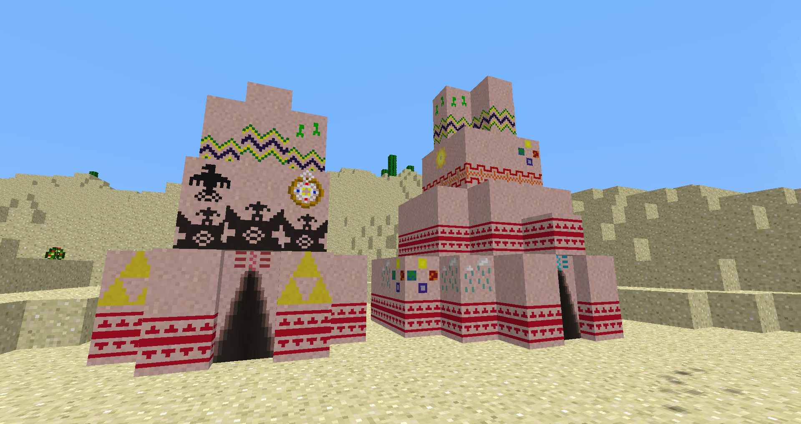
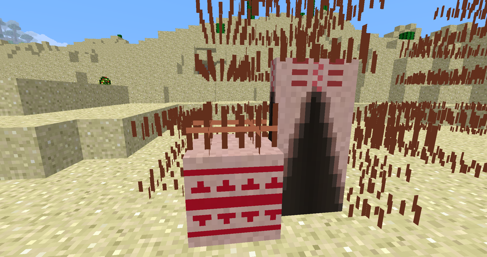
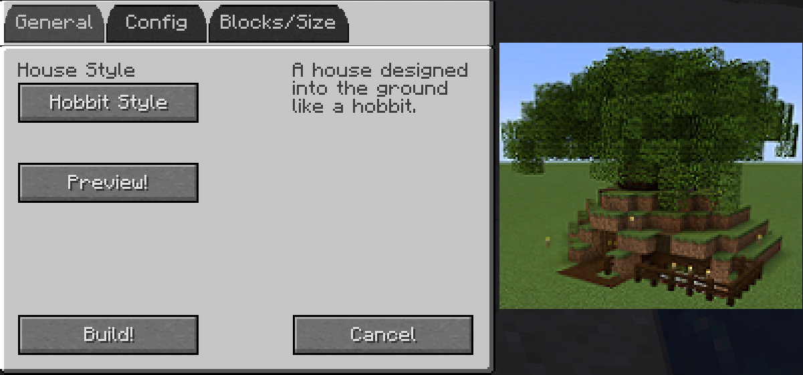
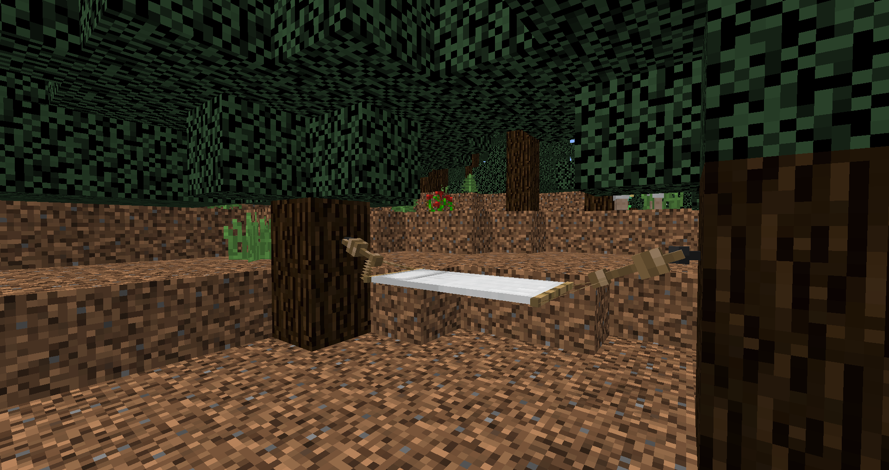

# Seeking somewhere to sleep!

Now you need somewhere to sleep!

Players have access to several methods of setting their spawn point, or creating shelter for the night.

Nomadic Tents offers several ways of putting a roof over your head. The tepe, seen above, is one way to do it!

Tepes are not the only tent to choose from, however. Nomadic Tents offers 5 different shelters: The Tepe, Yurt, Bedouin, Shamiyana and the Indlu.

Tents can have the indoor space as well as the indoor depth upgraded. A tent can only be upgraded starting at Medium size; you are only permitted one depth upgrade per size upgrade per tent.

After building your tent, place it down to see the framework. In order to "set up" your tent, you will need a Tent Mallet, or a Super Tent Mallet. Right-click each frame block with a Tent Mallet until the tent is completely set up. This is done instantly with the Super Tent Mallet.

The inside space of an upgraded tent will be much larger than the outside space it takes up. This allows for efficient use of space in the creation of something like a village. 

Once you're done, you can Right-click the door of your tent with a Tent Mallet to pack it up, and move somewhere else. Your belongings will still remain inside of your tent when you set up camp elsewhere.

Tents do not have to be moved either. As mentioned before, you can keep a tent in a single location and build some snazzy decorations around it! Go crazy!

Other methods available to the player include the "Prefab" mod.

This mod gives players accessibilty to a plethora of different structures to build, including shelters, farm houses, storage rooms, and even mob farms. See your JEI menu for complete crafting recipes!

Here is a preview of one of several Starting Houses available in the early game.

Players can choose from several others, including Ranch, Desert and Snowy style houses.

Once you have the item in your inventory, simply Right-click on the ground to bring up the configuration menu for your structure. You can immediately build your structure, or preview it before completing placement.

Houses are spawned standard with basic amenities like a Crafting Table, Furnace and Chests.

Structures like the Monster Masher will even spawn Mob Spawners upon placement.

Hammocks can be used to sleep the day away. Sleeping Bags can be used to sleep the night away. Hammocks will require some other items to set up, but are helpful for those who like to prowl at night.

Like regular beds however, Hammocks WILL set your spawn point to the most recent used Hammock. Keep this in mind.