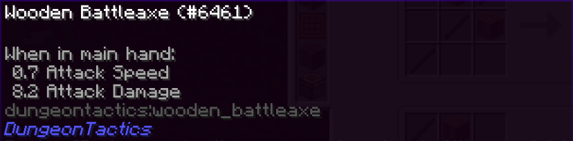
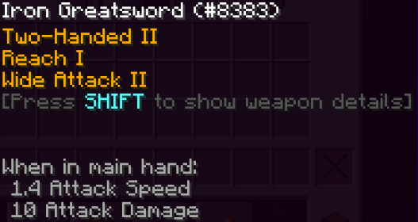
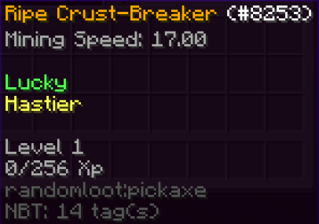
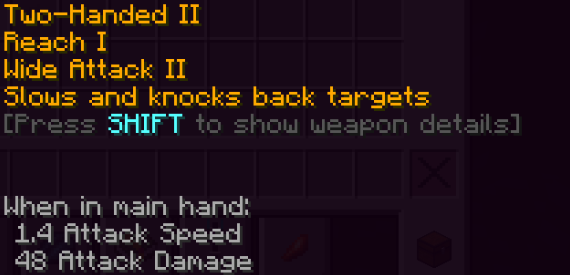
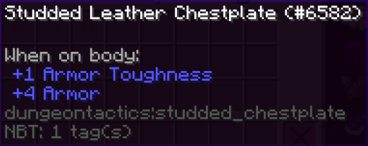
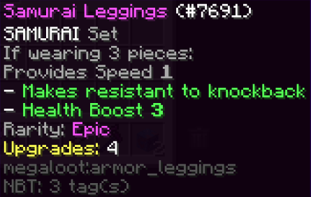
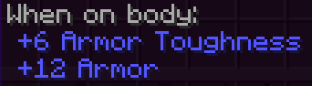

# Obtaining decent weapons and armor!

You're going to fight a lot of tough enemies throughout your adventures.

You're going to want to get geared from the get-go!

Besides basic tools like the pickaxe, axe, and shovel, you're going to need a sturdy weapon!

Though the attack speed is lower than a Diamond Sword, the Wooden Battleaxe deals a staggering 1.2 more damage than everyones' basic dream weapon.

This item should help you plow through enemies in the early game, until you can obtain something more reliable. You will realistically only have this weapon for about 10 to 15 minutes, if you're searching for a better place to mine or live.

The Iron Greatsword is your direct upgrade to the Wooden Battleaxe. With a higher attack speed and 1.8 more damage, this item will aid you heavily as you continue to push through an increasing difficulty.

You may sometimes obtain loot cases from either RandomLoot or MegaLoot. These mods are separate and have separate stations to repair their items at. Keep this in mind.

This aside, each tool, or piece of armor from the mod(s) has special effects on it. These items can become very powerful if time and resources are invested into them, and especially if you get lucky and get a good one.

Players constantly ask which gear from which mod is better. On average, items from MegaLoot are consistently more powerful. However, RandomLoot has its fair share of useful items that you can get lucky with.

Loot cases from both mods can be purchased from the Shop or found by exploring the Overworld, and Battle Towers.

Please note: ARMOR from RANDOMLOOT is bugged, and will lose its effects and stats when upgraded. This is a known bug. It cannot be fixed.

The Dragonsteel Greatsword (Ice or Fire) is the most powerful weapon in the game, straight out of the Crafting Table.

Dragonsteel weapons and armor will be obtainable much farther into your adventure.

See the Ice and Fire Guide or refer to your Bestiary for more information on Dragonsteel.

If you can't get tons of Iron in the early game, or want to save some of your resources, Studded Leather is a great alternative to the complete set of Iron Armor.

In the end, crafting Studded Leather over the complete set of Iron armor will save you about 10 ingots.

Armor from MegaLoot can be extremely powerful, and even comes with bonus effects when a partial set is worn. This gives leniency towards the player, allowing them to equip other supplemental gear found on their adventure.

Some armor can even grant flight!

Some armor has even better stats than Dragonsteel!

As mentioned above, MegaLoot cases can be purchased from the Shop.

Dragonsteel armor has the best basic stats in this modpack.

As was mentioned before, view the Ice and Fire Guide or refer to your Bestiary for more information on how to obtain Dragonsteel.

