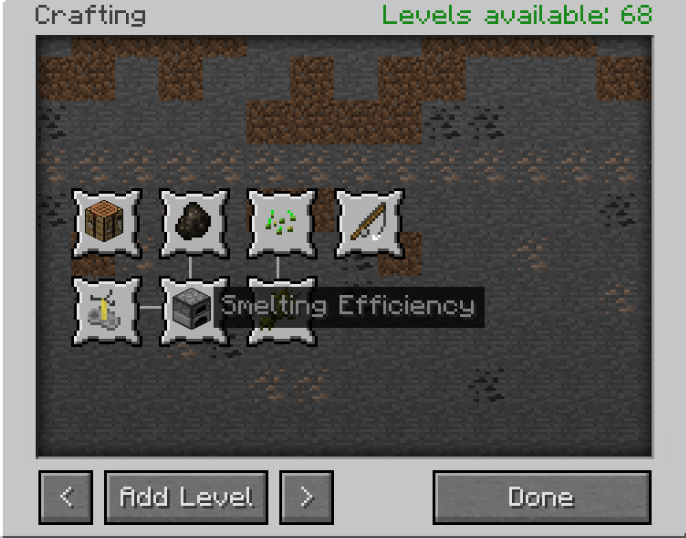

# The Level-Up System!

To access the Level-Up menu, check your Controls. It is likely conflicting with other bindings.

The Level-Up system allows players to select and upgrade certain passive skills which increase quality of life.

Players can access the menu and exchange 5 Experience Levels for 1 Skill Point.

They can then select a skill to upgrade from among many different options.

Players are permitted a core skill upon their first click. This core skill will increase experience gains from participating in the selected activity. All core skills can be gained.

All skills grant powerful bonuses in the long-run, but the most important of them all is the Smelting Efficiency perk under Crafting.

This perk allows for a chance at double output from smelting ore, but only with a Furnace bound to the player.

Players may bind one Furnace and one Brewing Stand. To bind a station, Shift Right-click with an empty hand.

# Leveling Up Fast!

To level up with more efficiency, be sure to constantly turn in your levels when you're below level 15. The book only cares about levels, and not total experience. Leveling up to 15 is much easier than leveling to 30, before you turn in all of your experience for skill points.