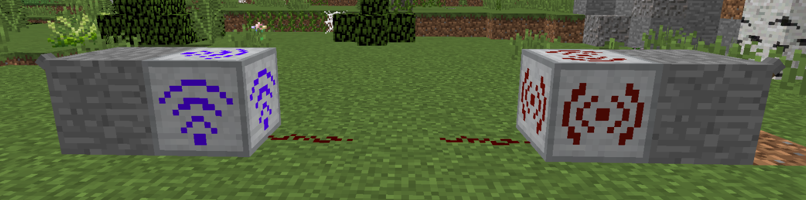
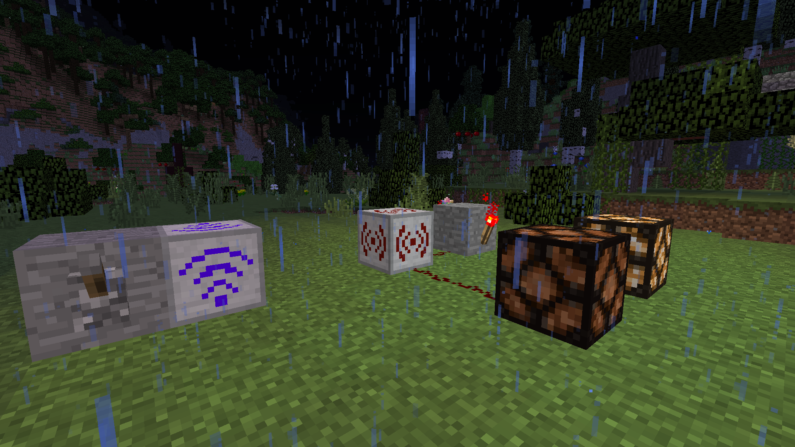
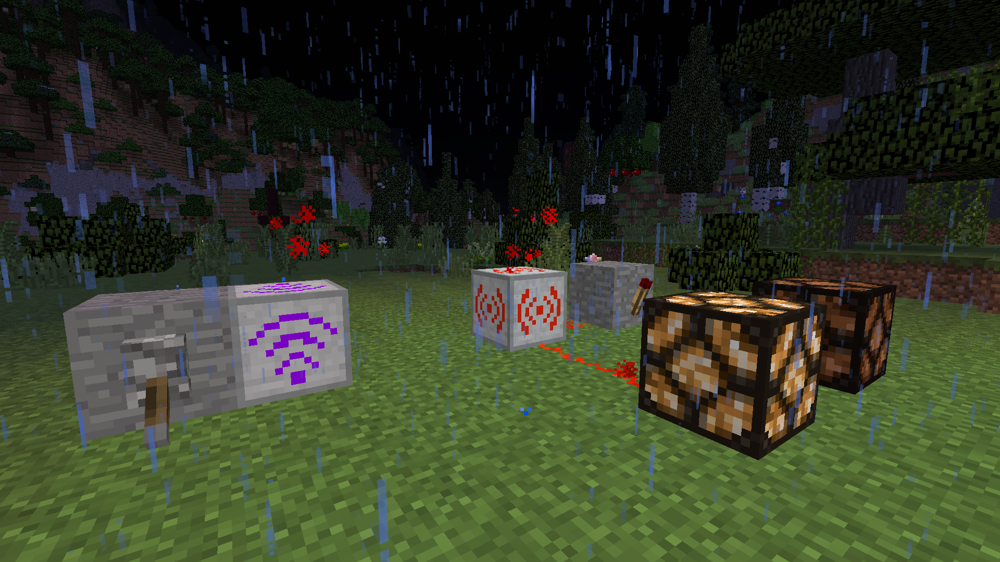

# Wireless Redstone Circuits
___

In this section, I'll show you how to set-up some wireless Redstone so you don't have to back huge wire paths all over the place ever again!

# Basic circuit and how it works
___

Here we can see a Wireless Transmitter and Receiver.

On each side of the Stone blocks is a lever to activate each end.

However, this is only for example sake. 

Note, the lever on the side of the Receiver (red) will not activate the circuit.

Only the activation of the Transmitter (blue) will activate the circuit.

The circuit is now activated. We can see that the Transmitter (blue) will activate the Receiver (red).

Notice that the Transmitter does not activate the Redstone placed next to it, but the Receiver does.

The Transmitter will never produce a Redstone signal itself, and only produces the signal at the selected location. If there is a Receiver at the location, a signal will activate.

If there is no signal, or a different type of Redstone other than a Wireless Receiver, it will do nothing.

# Wireless IF Switch
___

This circuit will open one pathway when the other is closed. You can set up several different paths to react differently once you have comprehended this part of the Guide.

In the picture we can see another Wireless Transmitter and Receiver. We can see the Receiver is outputing to a Stone block with a Redstone Torch on it; the Redstone Torch is then connected to a Redstone Lamp.

There is also another Redstone Lamp connected directly to the Receiver, instead of through a proxy.

Take notice that the Transmitter/Receiver is off, but one lamp is still active.

In this picture, you can see the Transmitter/Receiver is on, and the opposite lamp has turned on.

You'll also notice the Receiver has turned off the Redstone Torch.

The Redstone Torch is not necessarily off, but is more so being inverted, or suppressed from activating.

The Receiver turns the Redstone Torch off with its own activation, and inverts the status of the torch. This means anything that was turned on by being connected to that torch will be turned off.

Anything connected directly to the Receiver will then be turned on.

Once the Transmitter/Receiver is turned off once again, the lamp connected directly to the Receiver will turn off, and the Redstone Torch will no longer be "suppressed", turning on the lamp that IT is connected to.

This circuit can be easily utilized in mob farms and is actually done with the Monster Masher from Prefab.

Step 1: Create the IF Circuit on top of the roof of your farm; place the Receiver at the top of your farm, and connect it with Redstone to a block surrounded by Redstone Torches on the 3 remaining sides (as shown in the example).

Remember to connect your Transmitter to your Receiver at the top. Then place your Transmitter where you will activate it with a lever. Likely near the bottom of your farm, or where ever your activation room is.

Step 2: Take a second set of Transmitter/Receivers and connect your Transmitter with Redstone to the Receiver at the top of your farm. This way, when you activate it from the bottom, your second Transmitter will also be activated.

Take your second Receiver and place it near a lamp by your activation area. Connect it with Redstone.

Once everything is set up, the lamps at the ceiling, shining into the spawn area, will be lit up; this prevents mobs from spawning and saves you from lag.

The lamp in your activation area should be off, because its direct connection to the Transmitter/Receivers is OFF.

Activating your farm should cause the lamp in the activation area to light up, and the lamps at the ceiling of your farm to turn off, allowing mobs to spawn.

(Pictures not included for this explanation. Instructions are quite clear; go ham!)

